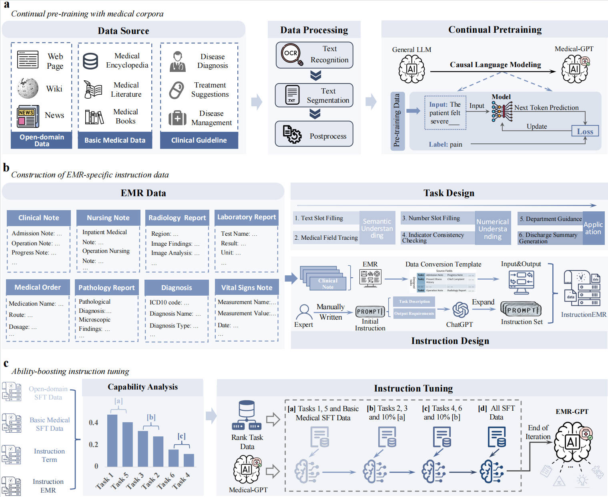

# EMR-GPT
A Large Language Model for Electronic Medical Records

# Method
The framework of EMR-GPT is shown in the following figure:

  

# Code Structure

`./train`:The dictory of training code.

`./evaluate`:The directory of evaluation code.

`dataset`:The directory of sample dataset.

# Acknowledgements

Special thanks to [hiyouga](https://github.com/hiyouga/LLaMA-Factory) for providing the LLaMA fine-tuning framework.

This project is based on [Chatglm3-6b](https://github.com/THUDM/ChatGLM3).

Thanks to the publishers for all opens-ource datasets. 